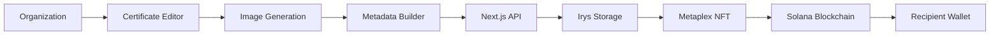
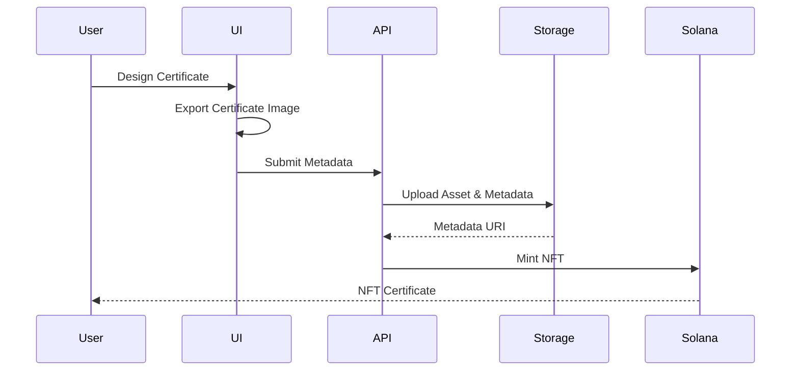

# Solana NFT Certificate Platform


> A full-stack Web3 application that enables organizations to design digital certificates in the browser and mint them as NFTs on the Solana blockchain, providing verifiable and tamper-resistant proof of ownership and authenticity.

---

# Overview

Traditional digital certificates are easy to duplicate and difficult to verify across organizations. This project provides an end-to-end certificate issuance platform where certificates are designed through a web interface, converted into NFT assets, uploaded with metadata, and minted on the Solana blockchain.

Built with **Next.js**, **TypeScript**, **Solana Wallet Adapter**, **Metaplex**, and **Fabric.js**, the application combines interactive certificate editing with decentralized ownership and verification.

---

# Motivation

The project explores how blockchain can improve the authenticity and traceability of digital certificates by replacing static downloadable documents with blockchain-backed NFTs owned directly by recipients.

---

# Features

| Feature | Description |
|---------|-------------|
| Interactive Certificate Editor | Design certificates directly in the browser |
| Wallet Authentication | Connect Solana wallets for minting |
| NFT Minting | Mint certificates as Solana NFTs |
| Metadata Generation | Creates NFT metadata from certificate information |
| REST API | Next.js API route for minting workflow |
| Fabric.js Integration | Canvas-based certificate editing |
| Image Export | Generate certificate images for NFT assets |
| Metaplex Integration | Uses Solana NFT metadata standards |
| Decentralized Storage | Supports decentralized asset storage through Irys |
| Modern UI | Built with Next.js App Router and React |

---

# Architecture



---

# Certificate Minting Workflow



---

# Repository Structure

```text
.
├── app/
│   ├── api/mint/
│   ├── layout.tsx
│   ├── page.tsx
│   └── ...
├── components/
│   ├── AppBar.tsx
│   ├── MintButton.tsx
│   ├── WalletContextProvider.tsx
│   └── ...
├── lib/
├── public/
├── styles/
├── metaplex-nft.ts
├── nft.ts
├── package.json
└── README.md
```

---

# Technology Stack

| Layer | Technology |
|------|------------|
| Frontend | Next.js 15, React, TypeScript |
| Styling | CSS Modules, Global CSS |
| Blockchain | Solana |
| Wallet | Solana Wallet Adapter |
| NFT Standard | Metaplex Token Metadata |
| Storage | Irys |
| Graphics | Fabric.js |
| API | Next.js Route Handlers |

---

# Installation

```bash
git clone https://github.com/eshwar4202/solana-nft-certificate-platform.git
cd solana-nft-certificate-platform
npm install
npm run dev
```

Open:

```text
http://localhost:3000
```

---

# Project Workflow

1. Connect a Solana wallet.
2. Design or customize a certificate.
3. Export the certificate as an image.
4. Generate NFT metadata.
5. Upload assets to decentralized storage.
6. Mint the NFT through the API.
7. Deliver the NFT certificate to the recipient's wallet.

---

# API

## `POST /api/mint`

Responsible for orchestrating the NFT minting workflow.

Typical responsibilities include:

- Receiving certificate information
- Preparing NFT metadata
- Uploading assets
- Minting via Solana/Metaplex
- Returning mint information

---

# Engineering Highlights

- Full-stack Next.js application
- App Router architecture
- Modular React components
- Blockchain wallet integration
- NFT metadata generation
- Client/server separation
- Interactive canvas editing
- RESTful backend endpoint
- TypeScript across the codebase

---

# Design Decisions

- **Next.js App Router** for unified frontend and backend development.
- **Fabric.js** for interactive certificate composition.
- **Metaplex** to follow Solana NFT metadata standards.
- **Wallet Adapter** to avoid handling private keys directly.
- **Route Handlers** encapsulate blockchain operations behind a clean API.

---

# Security Considerations

- Wallet-based authentication for signing transactions.
- Private keys are never embedded in the client.
- NFT ownership is recorded on-chain.
- Certificate authenticity can be verified through blockchain metadata.

---

# Limitations

- Designed as a prototype for certificate issuance.
- Currently focused on Solana NFTs.
- Bulk issuance workflows are not implemented.
- Role-based organization management is not included.

---

# Future Improvements

- Batch certificate issuance
- QR-code based certificate verification
- Recipient management dashboard
- Multi-network blockchain support
- IPFS storage support
- Organization authentication
- Certificate revocation and renewal

---

# Contributing

Contributions are welcome. Please open an issue before proposing significant changes and follow consistent coding and documentation practices.

---

# License

MIT License.

---

# Acknowledgements

- Solana
- Metaplex Foundation
- Next.js
- React
- Fabric.js
- Irys
